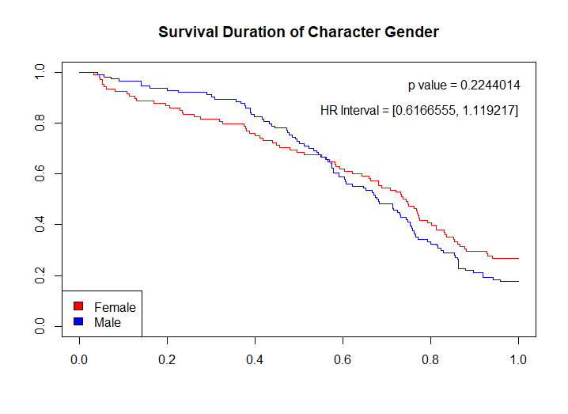

```{r setup, include=FALSE}
knitr::opts_chunk$set(echo = FALSE)
```

For the final project in the Survival Analysis course, a classmate and I recorded and analyzed the survival times of 222 characters in 26 slasher films spanning the 1970's to the 2010's. 


# Project Overview

Going into the project, we established multiple hypotheses to be tested and used these to determine what data to collect. To standardize the data collection, we discussed and agreed upon the variable criteria. Our main areas of interest included binary variables 'promiscuity', 'drugs_alcohol', and 'fights_back', as well as qualitative variables such as 'gender', 'ethnicity', and 'year_released', all of which became categorical data for our analysis. After collecting the data, we created Kaplan-Meier curves and a Cox PH and Weibull model for each variable of interest, using the p values, hazard ratios, and Kaplan-Meier curves to determine if we could reject the null hypotheses. We also performed multivariate analysis and created Cox Proportional Hazard tables to see how variables interacted with one another. 

We considered the limitations of our analysis, which stemmed from creating the dataset ourselves. We interpreted our variable analysis, putting our findings into the bigger picture, and summarized the main insights. 


*The following is an excerpt from our project's website, which delves deeper into our data collection decisions, as well as one of the Kaplan Meier curves.*

### Data Collection

For a project like this, there was no dataset we could find to suit our needs, so we decided to create our own. First we had to determine how to define slashers in order to decide which movies to include in the dataset. We wanted to define slasher films based on the most prevalent, trope-like characteristics: a psychopathic killer stalks and graphically murders a group of adolescent victims. We did not include movies with supernatural killers such as 'Final Destination' or movies that focus or include only one victim, such as 'Hush'. We started out with the most popular, well-known slasher films such as 'Halloween', 'Scream', and 'Friday the 13th', and went from there picking the most popular movies that fit our definition. In order to get a good spread of the sub-genre, we decided to pick five movies from each decade, starting in the 1970's and ending in the 2010's. We recorded each character death caused by the slasher, and included main characters who survived attacks by the slasher. 




## Slasher Survival Analysis Site

The official project website can be found [here](https://hhadges.wixsite.com/slashersurvival/services).


For more information about how we created this project, please visit:

[GitHub Repo](https://github.com/hayleyhadges/STAT453SlasherFinal)